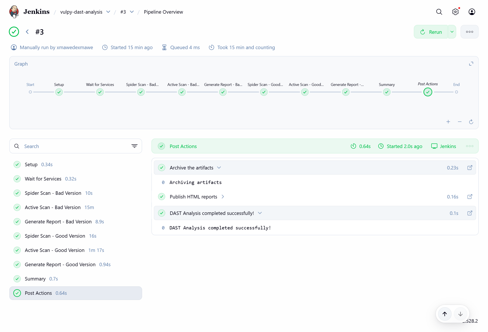
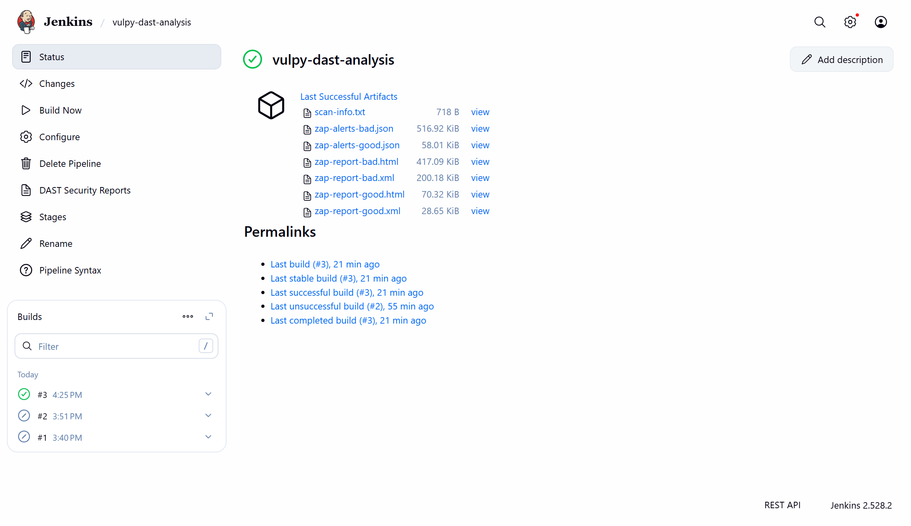

# Vulpy DAST Analysis with OWASP ZAP



## 📋 Table of Contents

- [Overview](#overview)
- [Architecture](#architecture)
- [Prerequisites](#prerequisites)
- [Quick Start](#quick-start)
- [Pipeline Stages](#pipeline-stages)
- [Generated Reports](#generated-reports)
- [Vulnerabilities Detected](#vulnerabilities-detected)
- [Project Structure](#project-structure)
- [Screenshots](#screenshots)
- [Troubleshooting](#troubleshooting)

## 🎯 Overview

This project performs **Dynamic Application Security Testing (DAST)** on the Vulpy web application using **OWASP ZAP** (Zed Attack Proxy). The analysis compares two versions of the application:

- **Bad Version** (Vulnerable): Intentionally vulnerable application running on port 5000
- **Good Version** (Secured): Fixed version with security corrections on port 5001

The entire workflow is automated through a Jenkins CI/CD pipeline that orchestrates OWASP ZAP scans and generates comprehensive security reports.

## 🏗️ Architecture

```
┌─────────────────┐     ┌──────────────────┐     ┌─────────────────┐
│   Jenkins       │────▶│   OWASP ZAP      │────▶│   Vulpy Bad     │
│   Port: 8080    │     │   Port: 8090     │     │   Port: 5000    │
└─────────────────┘     └──────────────────┘     └─────────────────┘
                                 │
                                 ▼
                        ┌─────────────────┐
                        │   Vulpy Good    │
                        │   Port: 5001    │
                        └─────────────────┘
```

### Components

- **Jenkins**: Orchestrates the DAST pipeline and manages artifacts
- **OWASP ZAP**: Performs spider scans and active security testing
- **Vulpy Bad**: Vulnerable Flask application for testing
- **Vulpy Good**: Secured version with vulnerability fixes
- **Docker Network**: `vulpy-dast-network` for container communication

## 📦 Prerequisites

- **Docker** & **Docker Compose** installed
- **8GB RAM** minimum (for ZAP and Jenkins)
- **Ports available**: 8080 (Jenkins), 8090 (ZAP), 5000 (Vulpy-bad), 5001 (Vulpy-good)
- **Git** for cloning the repository

## 🚀 Quick Start

### 1. Clone and Navigate

```bash
git clone <repository-url>
cd vulpy-dast-analysis
```

### 2. Start All Services

```bash
docker-compose up -d
```

This will start:
- Jenkins (jenkins-dast)
- OWASP ZAP (owasp-zap)
- Vulpy Bad (vulpy-bad)
- Vulpy Good (vulpy-good)

### 3. Access Services

| Service | URL | Purpose |
|---------|-----|---------|
| Jenkins | http://localhost:8080 | CI/CD Pipeline Interface |
| OWASP ZAP | http://localhost:8090 | Security Scanner API |
| Vulpy Bad | http://localhost:5000 | Vulnerable Application |
| Vulpy Good | http://localhost:5001 | Secured Application |

### 4. Configure Jenkins

Get the initial admin password:

```bash
docker exec jenkins-dast cat /var/jenkins_home/secrets/initialAdminPassword
```

Or check Jenkins logs:

```bash
docker logs jenkins-dast 2>&1 | grep -A 5 "password"
```

### 5. Create Jenkins Pipeline

1. Open Jenkins at http://localhost:8080
2. Log in with the admin password
3. Click **"New Item"**
4. Enter name: `vulpy-dast-analysis`
5. Select **"Pipeline"**
6. In **Pipeline** section:
   - Definition: **Pipeline script from SCM**
   - SCM: **Git** (or select **Pipeline script** and paste Jenkinsfile content)
   - Script Path: `Jenkinsfile`
7. Click **"Save"**

### 6. Run the Pipeline

Click **"Build Now"** to start the DAST analysis.

⏱️ **Expected Duration**: 15-25 minutes (active scans take time)

## 📊 Pipeline Stages

The Jenkinsfile defines 9 stages:

### Stage 1: Setup
- Creates report directories
- Initializes scan metadata

### Stage 2: Wait for Services
- Verifies ZAP is accessible
- Checks Vulpy Bad and Good are running
- Retries up to 30 times with 2-second intervals

### Stage 3: Spider Scan - Bad Version
- Crawls the vulnerable application
- Discovers all URLs and entry points
- Builds site tree for active scanning

### Stage 4: Active Scan - Bad Version
- Performs automated attacks (SQL injection, XSS, etc.)
- Tests each discovered endpoint
- Progress tracked in real-time
- **Timeout**: 20 minutes

### Stage 5: Generate Report - Bad Version
- Creates HTML report for visualization
- Generates JSON report for programmatic analysis
- Exports XML report for external tools

### Stage 6: Spider Scan - Good Version
- Clears previous session
- Crawls the secured application
- Maps all endpoints

### Stage 7: Active Scan - Good Version
- Tests secured version for vulnerabilities
- Compares results with bad version
- **Timeout**: 20 minutes

### Stage 8: Generate Report - Good Version
- Exports reports in HTML, JSON, and XML formats
- Documents remaining vulnerabilities

### Stage 9: Summary
- Counts vulnerabilities by severity (High, Medium, Low, Informational)
- Compares bad vs. good version results
- Displays file sizes and scan metadata



## 📁 Generated Reports

After pipeline completion, reports are available in `dast-reports/`:

```
dast-reports/
├── zap-report-bad.html         # HTML report for vulnerable version
├── zap-alerts-bad.json         # JSON alerts for vulnerable version
├── zap-report-bad.xml          # XML report for vulnerable version
├── zap-report-good.html        # HTML report for secured version
├── zap-alerts-good.json        # JSON alerts for secured version
├── zap-report-good.xml         # XML report for secured version
└── scan-info.txt               # Scan metadata and summary
```

### Accessing Reports in Jenkins

1. Go to the build page
2. Click **"DAST Security Reports"** in the left sidebar
3. View HTML reports directly in Jenkins
4. Download JSON/XML for integration with other tools

## 🔍 Vulnerabilities Detected

OWASP ZAP tests for:

| Category | Examples |
|----------|----------|
| **Injection** | SQL Injection, Command Injection, LDAP Injection |
| **XSS** | Reflected XSS, Stored XSS, DOM XSS |
| **Authentication** | Weak passwords, Session fixation, Broken auth |
| **Sensitive Data** | Unencrypted data, Exposed credentials |
| **XXE** | XML External Entity attacks |
| **Broken Access Control** | Path traversal, Insecure direct object references |
| **Security Misconfiguration** | Default credentials, Directory listing |
| **CSRF** | Missing CSRF tokens |
| **Known Vulnerabilities** | Outdated libraries, CVEs |
| **Logging & Monitoring** | Insufficient logging |

### Risk Levels

- 🔴 **High**: Critical security issues requiring immediate attention
- 🟠 **Medium**: Significant vulnerabilities that should be addressed
- 🟡 **Low**: Minor issues or security improvements
- 🔵 **Informational**: Best practices and recommendations

## 📂 Project Structure

```
vulpy-dast-analysis/
├── docker-compose.yml           # Orchestrates all services
├── Dockerfile.jenkins           # Custom Jenkins image with tools
├── Jenkinsfile                  # DAST pipeline definition
├── README.md                    # This file
├── screenshoots/                # Pipeline and artifacts screenshots
│   ├── pipline-overview.png
│   └── build-artifact.png
├── vulpy/                       # Vulpy application source
│   ├── Dockerfile
│   ├── requirements.txt
│   ├── bad/                     # Vulnerable version
│   │   ├── vulpy.py
│   │   ├── libuser.py
│   │   └── ...
│   └── good/                    # Secured version
│       ├── vulpy.py
│       ├── libuser.py
│       └── ...
└── dast-reports/                # Generated by pipeline
    ├── zap-report-bad.html
    ├── zap-report-good.html
    └── ...
```

## 📸 Screenshots

### Pipeline Execution


The pipeline shows all 9 stages with execution times and status indicators.

### Build Artifacts


Jenkins archives all generated reports and makes them accessible for download.

## 🔧 Troubleshooting

### Issue: Jenkins password not found

```bash
docker logs jenkins-dast 2>&1 | grep -A 5 "password"
```

### Issue: ZAP not accessible

Check ZAP container:
```bash
docker logs owasp-zap
docker exec jenkins-dast curl -I http://owasp-zap:8090
```

### Issue: Vulpy applications not responding

Verify containers are running:
```bash
docker ps | grep vulpy
docker logs vulpy-bad
docker logs vulpy-good
```

Check network connectivity:
```bash
docker exec jenkins-dast curl -I http://vulpy-bad:5000
docker exec jenkins-dast curl -I http://vulpy-good:5000
```

### Issue: Active scan taking too long

Active scans can take 15-25 minutes for vulnerable applications. This is normal. Check progress:
```bash
docker exec jenkins-dast curl -s "http://owasp-zap:8090/JSON/ascan/view/scans/?apikey=dast-api-key-2025"
```

### Issue: Port conflicts

If ports are already in use, modify `docker-compose.yml`:
```yaml
ports:
  - "8081:8080"  # Change Jenkins to 8081
```

## 🔄 Workflow Example

### 1. Initial Scan (Before Corrections)

```bash
# Run pipeline
# Wait for completion (~20 minutes)
# Download reports
```

### 2. Analyze Results

- Open `zap-report-bad.html` in browser
- Identify HIGH severity vulnerabilities
- Review attack details and evidence
- Select 2 critical issues to fix

### 3. Apply Fixes

Edit files in `vulpy/good/` to fix vulnerabilities:
- SQL Injection → Use parameterized queries
- XSS → Implement output encoding
- Missing headers → Add security headers
- Weak sessions → Strengthen session management

### 4. Re-scan (After Corrections)

```bash
# Rebuild vulpy-good
docker-compose stop vulpy-good
docker-compose rm -f vulpy-good
docker-compose build vulpy-good
docker-compose up -d vulpy-good

# Run pipeline again
```

### 5. Verify Fixes

Compare `zap-report-bad.html` vs `zap-report-good.html`:
- Verify vulnerabilities are resolved
- Check alert counts decreased
- Document remaining issues

## 🛠️ Useful Commands

```bash
# View ZAP logs in real-time
docker logs owasp-zap -f

# View Jenkins logs
docker logs jenkins-dast -f

# Check scan progress
docker exec jenkins-dast curl -s "http://owasp-zap:8090/JSON/ascan/view/scans/?apikey=dast-api-key-2025"

# Restart all services
docker-compose down

# Clean up volumes
docker-compose down -v

# View container status
docker ps -a | grep -E "jenkins-dast|owasp-zap|vulpy"
```

## 📚 Additional Resources

- [OWASP ZAP Documentation](https://www.zaproxy.org/docs/)
- [OWASP Top 10](https://owasp.org/www-project-top-ten/)
- [Jenkins Pipeline Documentation](https://www.jenkins.io/doc/book/pipeline/)
- [Docker Compose Reference](https://docs.docker.com/compose/)

## 📄 License

This project is for educational and testing purposes only.

---

**Note**: Always perform security testing on authorized systems only. The Vulpy application is intentionally vulnerable and should never be deployed in production environments.

Cette analyse est effectuée dans un environnement contrôlé à des fins pédagogiques. Ne jamais scanner d'applications en production sans autorisation explicite.
